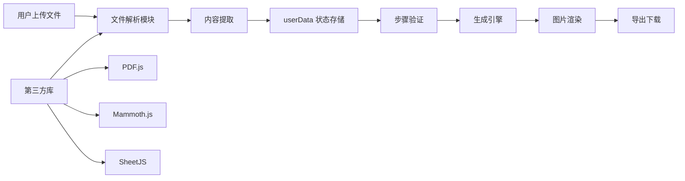

# CLAUDE.md

This file provides guidance to Claude Code (claude.ai/code) when working with code in this repository.

## 项目概述

这是一个纯前端的电商详情页生成工具，通过四步向导流程帮助电商卖家快速生成商品详情页和轮播图。支持多种文件格式上传，自动解析文档内容，生成营销素材，简化电商运营流程。

## 常用命令

### 本地开发运行
```bash
# 使用 Python 启动本地服务器
python -m http.server 8000

# 使用 Node.js
npx serve -p 8000
npx http-server -p 8000

# 访问 http://localhost:8000
```

### 部署命令
```bash
# GitHub Pages 部署
git push origin main  # 推送后自动部署

# Netlify CLI（如果使用）
netlify deploy --prod --dir=.
```

## 高级代码架构和结构

### 整体架构模式

项目采用**模块化单体架构**，通过原生 JavaScript ES6+ 实现组件化开发：

1. **入口层**：`index.html` - 单页应用入口，集成第三方 CDN 资源
2. **状态管理层**：`js/steps.js` - 集中式状态管理，控制四步向导流程
3. **业务逻辑层**：
   - `js/app.js` - 核心业务逻辑（文件处理、品类管理）
   - `js/generator.js` - 内容生成引擎（轮播图、详情页生成）
4. **表现层**：`css/style.css` - 响应式样式系统

### 核心数据流



### 重要的代码模式和流程

#### 1. 文件处理管道模式

在 `js/app.js` 中实现了统一的文件处理管道：

```javascript
// 核心处理流程
handleMultiFormatUpload() {
    1. 文件类型识别
    2. 选择解析器（PDF/Word/Excel/图片）
    3. 内容提取与预览
    4. 数据存储到 userData
}
```

**解析器策略模式**：
- PDF 解析：`pdfjsLib.getDocument()` - 限制前10页，避免内存溢出
- Word 解析：`mammoth.extractRawText()` - 提取纯文本内容
- Excel 解析：`XLSX.read()` + `sheet_to_json()` - 限制前20行

#### 2. 状态机驱动的步骤管理

`js/steps.js` 实现了经典的状态机模式：

```javascript
// 状态转换流程
nextStep() {
    validateStep() → updateProgress() → renderStep() → triggerGeneration()
}
```

**关键特性**：
- 集中式 `userData` 对象存储全局状态
- 步骤间严格的数据验证
- 进度条 UI 与状态同步
- 支持步骤回退和重置

#### 3. 动态内容生成引擎

`js/generator.js` 实现了基于模板的内容生成：

```javascript
// 生成策略
generateDetailPages() {
    1. 随机确定数量（轮播图5-8，详情页10-13）
    2. 从预定义类型池选择
    3. 动态创建 DOM 元素
    4. 绑定交互事件（拖拽、删除、编辑）
}
```

**高级功能实现**：
- **拖拽排序系统**：HTML5 Drag & Drop API + 360度方向调整
- **批量操作模式**：复选框选择 + 批量删除/导出
- **参考图上传**：每张图支持独立参考图
- **文字标注系统**：内联编辑 + 实时保存

#### 4. 第三方库集成模式

采用 CDN 异步加载 + 全局变量引用：

```html
<!-- index.html 中的库加载 -->
<script src="https://cdnjs.cloudflare.com/ajax/libs/pdf.js/3.11.174/pdf.min.js"></script>
<script>
    pdfjsLib.GlobalWorkerOptions.workerSrc = '...';
</script>
```

## 技术决策与权衡

### 为什么选择原生 JavaScript？
- **轻量级**：无构建依赖，加载速度快
- **兼容性**：避免框架版本冲突
- **部署简单**：纯静态文件，适合 CDN 分发
- **维护成本低**：减少技术栈复杂度

### 文件大小与功能平衡
- PDF 限制 10 页：防止浏览器内存溢出
- Excel 限制 20 行：避免大量数据渲染卡顿
- 图片数量随机化：保证内容多样性

### 第三方库版本选择
- PDF.js 3.11.174：稳定版本，兼容性好
- Mammoth.js 1.6.0：支持最新 Word 格式
- SheetJS 0.18.5：功能完整，体积适中

## 性能优化策略

1. **懒加载**：第三方库按需加载
2. **事件委托**：减少事件监听器数量
3. **文件流读取**：避免大文件内存占用
4. **DOM 复用**：生成内容时复用元素结构
5. **图片压缩**：Canvas API 自动优化导出图片

## 部署架构

### Netlify 配置优化

```toml
# netlify.toml
[[redirects]]
  from = "/*"
  to = "/index.html"
  status = 200

[build]
  publish = "."
  command = "echo 'No build required'"
```

**特性**：
- SPA 路由支持
- 零构建时间
- 自动 HTTPS
- 全球 CDN 分发

## 扩展点与自定义

### 添加新的文件格式支持
1. 在 `handleMultiFormatUpload()` 中添加新的 case
2. 引入对应的解析库
3. 实现内容提取函数
4. 更新 accept 属性

### 自定义生成模板
1. 修改 `generator.js` 中的 `carouselTypes` 和 `detailTypes` 数组
2. 实现对应的生成逻辑
3. 添加相关的样式类

### 扩展品类系统
1. 在 `app.js` 中的 `categories` 数组添加新品类
2. 可选：添加图标和子分类支持
3. 更新搜索过滤逻辑

## 浏览器兼容性要求

- **Chrome 70+**：完整功能支持
- **Firefox 65+**：支持主要功能
- **Safari 12+**：iOS 兼容
- **Edge 79+**：Chromium 内核支持

**关键 API 依赖**：
- File API（文件读取）
- Canvas API（图片处理）
- Drag & Drop API（拖拽排序）
- Fetch API（可选的网络请求）

## 最后更新

2025-12-11

## 已知问题 (Known Issues)

-   **HTML 结构问题**: `index.html` 中的 script 标签位于 body 结束标签之后，虽然浏览器通常能容错处理，但这不是标准的 HTML 结构。建议修正为放在 body 结束标签之前。

## 开发工具建议

-   **VS Code Live Server**: 推荐使用 VS Code 的 Live Server 扩展进行本地开发预览，以支持模块加载和避免跨域问题。
-   **浏览器开发者工具**: 建议在移动端模式下调试，以验证响应式布局。

## 代码规范与约定

-   **状态管理**: 使用 `userData` (在 `steps.js` 中定义) 作为全局状态对象，通过 `window.userData` 访问。
-   **DOM 操作**: 统一使用 `document.getElementById` 和 `querySelector`，不依赖 jQuery 等库。
-   **函数式组合**: `app.js` 和 `steps.js` 倾向于使用函数组合 (Functional Composition) 模式，保持函数纯度和单一职责。
-   **命名规范**:
    -   变量/函数: 小驼峰 (`camelCase`)
    -   类名: 大驼峰 (`PascalCase`) - 尽管本项目主要使用函数
    -   常量: 全大写下划线 (`UPPER_SNAKE_CASE`)
    -   CSS 类: 短横线连接 (`kebab-case`)

## 测试策略

-   **手动测试 (Manual Testing)**: 本项目目前没有自动化测试框架。所有更改必须通过手动测试流程验证：
    1.  上传不同格式的文件 (PDF, Word, Excel, Image)
    2.  完整走完 4 步向导流程
    3.  生成并下载图片，检查内容准确性
    4.  测试拖拽排序功能
